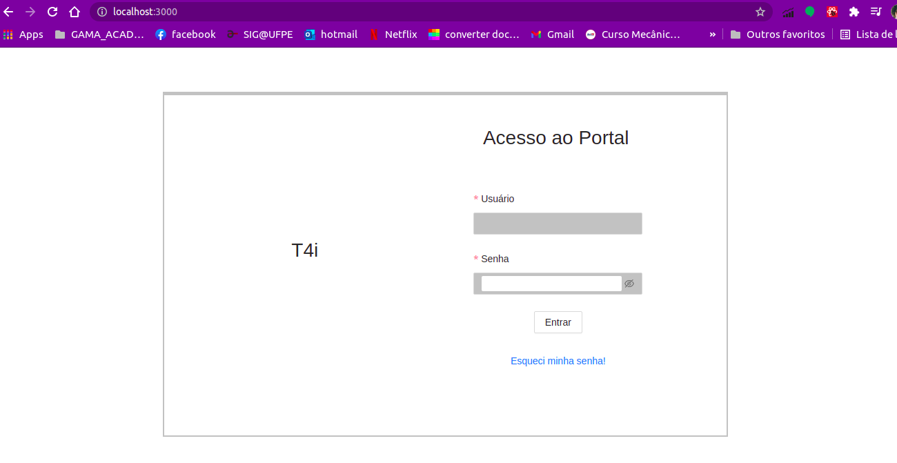
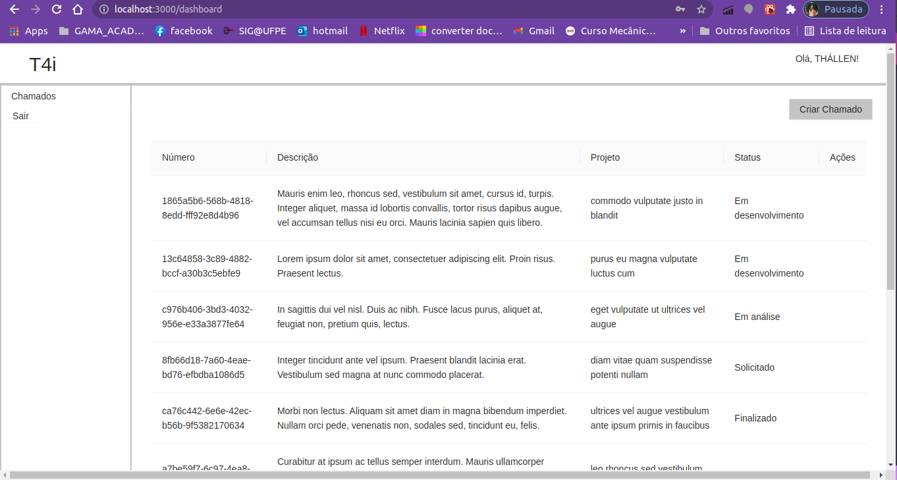
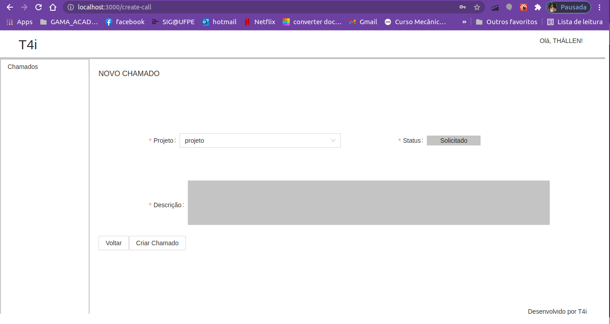
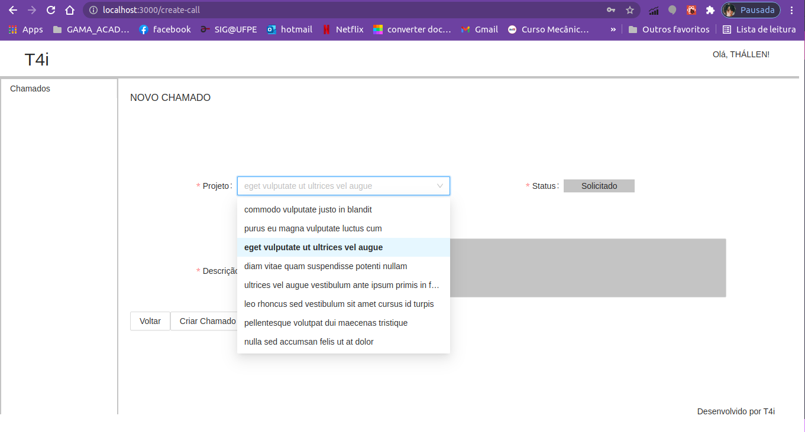
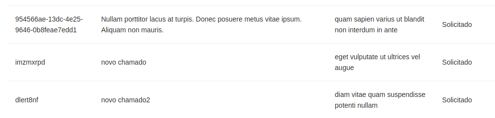

This project was bootstrapped with [Create React App](https://github.com/facebook/create-react-app), using the [Redux](https://redux.js.org/) and [Redux Toolkit](https://redux-toolkit.js.org/) template.

## Available Scripts

In the project directory, you can run:

### `npm start`

Runs the app in the development mode. 
Open [http://localhost:3000](http://localhost:3000) to view it in the browser.

## The project

It is a project created with typscript using the redux toolkit to manage datas on the app.

There area 3 views: 

1. Login Page:

2. Dashboard Page

It's used the redux to show the user name and list all the calls and the antd to help on all styles and components.

3. Forms Page

To fill the project selector, It is used the redux as well.

It's added to the call list using redux the new call that comes from the forms and after that, it's showed on the dashboardpage.
You can also click on "sair" to logout the app.

When you click on "criar chamado" ant the end of the forms, the call is listed on dashboard page.

